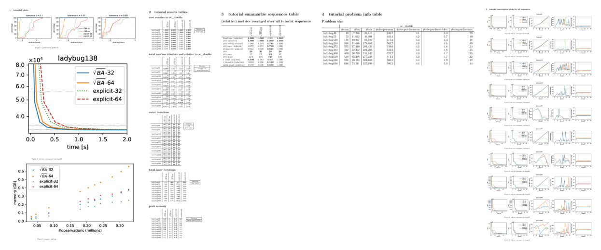
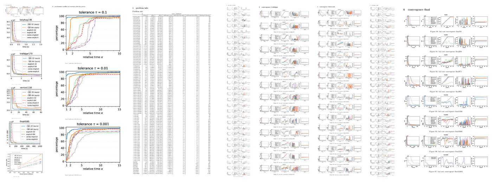

# Batch Evaluation Tutorial

## Introduction

In this tutorial we run and evaluate experiments for 10 exemplary
sequences from the BAL dataset. This is divided into 4 steps: 1)
generating config files, 2) getting the data, 3) running bundle
adjustment, 4) generating result tables and plots. In the end, we
discuss how to reproduce the results from the CVPR'21 paper in a
similar way, but it takes much longer to run of course.

## Prerequisites

We assume that you have installed dependencies (including Python
packages and LaTeX) and compiled the code as described in the README.

## Generating configurations

We use the `generate-batch-configs.py` script to systematically
generate config files in a specific folder structure. Let's first
prepare a folder, copy the provided `rootba_batch_config.toml` file
that defines which experiments we want to run, and then generate
configs from it.

```
mkdir ../rootba_experiments
cp examples/batch/rootba_batch_config.toml ../rootba_experiments/
./scripts/generate-batch-configs.py ../rootba_experiments/
```

You should see in the output that 40 config files were generated in
the `01_tutorial/1_rootba_qr` folder.

```
../rootba_experiments/01_tutorial/1_rootba_qr/rootba_config_it20_rootbaqr_double_ladybug49.toml
../rootba_experiments/01_tutorial/1_rootba_qr/rootba_config_it20_rootbaqr_double_ladybug73.toml
../rootba_experiments/01_tutorial/1_rootba_qr/rootba_config_it20_rootbaqr_double_ladybug138.toml
[...]
```

The `rootba_batch_config.toml` file has detailed comments explaining
the format and how to modify it for your needs.

> *Note:* To manage changes in experiment configs and keep track of
> experiment logs, you can optionally use git with the LFS
> extension. For this, make sure that git LFS is [installed and
> enabled](https://git-lfs.github.com/). Then initialize a git
> repository and add the provided config files.
> 
> ```
> cp examples/batch/gitignore ../rootba_experiments/.gitignore
> cp examples/batch/gitattributes ../rootba_experiments/.gitattributes
> cd ../rootba_experiments
> git init
> git add .gitignore .gitattributes
> git commit -m'initial commit'
> ```
> 
> After that, you can add configs and results with the regular `git
> add` and `git commit` commands.

## Getting data

If you check the definition of data sources for the different
sequences in the `rootba_batch_config.toml` file, you see that we
expect the test data to be in a folder `../rootba_data/`. The easiest
way to get the test data is using our downloader script.

```
./scripts/download-bal-problems.sh tutorial
```

With the argument `tutorial` it only downloads the 10 sequences needed
for the tutorial. You can also pass `all`, which then downloads all 97
sequences.

If you are planning to try out additional datasets, it might also be
convenient to use our mirror git LFS repository instead of the
downloader script. First, make sure that git LFS is [installed and
enabled](https://git-lfs.github.com/). Then, you can download the
datasets with:

```
cd ..
git clone https://gitlab.vision.in.tum.de/rootba/rootba_data.git
```

However, this downloads all datasets at once and uncompressed, which
amounts to around **15GB**.

## Running experiments

Make sure you have compiled the project and the executables are up to
date (e.g. run `./scripts/build-rootba.sh`).

> *Note:* The run-script assumes that the executables are in the
> `bin/` folder in the `rootba` repository root, which is the default
> location if you follow the README for building `rootba`. If your
> binaries are in a different location, you can export the
> `ROOTBA_BIN_DIR` environment variable and set it to the
> corresponding folder.

With that we can start running the experiments. If you want a fair
evaluation, make sure no other process takes up CPU resources while
the experiments are running.

```
./scripts/run-all-in.sh ../rootba_experiments/01_tutorial/
```

While the experiments are running, you can optionally check the
status. In a second terminal, run:

```
./scripts/list-jobs.sh ../rootba_experiments/01_tutorial/
```

You should see output such as the following, indicating the completed,
running, and not yet started runs:

```
../rootba_experiments/01_tutorial/20210619-024332/1_rootba_qr/it20_rootbaqr_double_ladybug138 : completed
../rootba_experiments/01_tutorial/20210619-024332/1_rootba_qr/it20_rootbaqr_double_ladybug318 : completed
../rootba_experiments/01_tutorial/20210619-024332/1_rootba_qr/it20_rootbaqr_double_ladybug372 : completed
../rootba_experiments/01_tutorial/20210619-024332/1_rootba_qr/it20_rootbaqr_double_ladybug412 : unknown - started
../rootba_experiments/01_tutorial/20210619-024332/1_rootba_qr/it20_rootbaqr_double_ladybug460 : unknown - not started
[...]
```

Moreover, as you can see in the output, the experimental runs are
placed in a subfolder with the current date and time and each of the
configs gets it's own subfolder within.

## Generating results tables and plots

Once the experiments run has completed, we use `generate-tables.py` to
generate a pdf with tables and plots. It takes a `experiments.toml`
file as input which defines which evaluations we want to do. We have
an example prepared. See comments in the file for further details.

```
cp examples/batch/experiments-tutorial.toml ../rootba_experiments/
./scripts/generate-tables.py --config ../rootba_experiments/experiments-tutorial.toml --open
```

> *Note:* If you ran `./scripts/run-all-in.sh` multiple times, you
> might get an error like
> 
> ```
> [...]
> RuntimeError: ladybug412 appears multiple times in experiment qr_float:
>  - /Users/demmeln/work/slam/rootba/rootba_experiments/01_tutorial/20210620-221258/1_rootba_qr/it20_rootbaqr_float_ladybug412
>  - /Users/demmeln/work/slam/rootba/rootba_experiments/01_tutorial/20210620-214304/1_rootba_qr/it20_rootbaqr_float_ladybug412
> Do your experiment pattern(s) '01_tutorial/*/1_*/*qr_float*' match too many directories? Delete the additional runs or narrow the pattern.
> ```
> 
> This is because the experiments patterns in the provided
> `experiments-tutorial.toml` file matches any date and time for the
> output folder. You can either delete the additional output folders
> (e.g. `rootba_experiments/01_tutorial/20210620-221258` in the above
> example) or narrow the pattern definition in the experiments config,
> e.g.:
>
> ```
> [[experiments]]
> name = "qr_float"
> display_name = "$\\sqrt{BA}$-32"
> pattern = "01_tutorial/20210620-214304/1_*/*qr_float*"
> ```

The `--open` command line argument will open the generated PDF in the
default viewer, but you can also find it in under
`../rootba_experiments/tables/experiments-tutorial.pdf`.



> *Note:* Experiment runs are cached by the `generate-tables.py`
> script. The cache is invalidated automatically if you change
> anything in the experiment definition that affects the searched
> folders such as the `pattern` or `filter_regex` keys. The cache is
> however **not** automatically invalidated, if just something changes
> in the matched output folders on the disk (since the whole point of
> caching is that we don't have to traverse the directory structure
> again looking for logs). For example, if in the tutorial, after
> generating result tables once, you delete the output folder, rerun
> the experiments, and regenerate tables, it will still use the old
> cached results. In that case, either delete the cache folder or add
> the `--override-cache` command line argument to
> `generate-tables.py`.

## Reproducing CVPR'21 results

In a similar way to the above you can run more extensive experiments
to reproduce the results from the CVPR'21 paper. In the following we
give a brief summary of the steps that differ from the tutorial. For
more detailed explanations, please start by following the tutorial
above. The instructions here assume that you have completed the steps
described in the tutorial.

First, modify the `../rootba_experiments/rootba_batch_config.toml`
file and uncomment the corresponding parts in the section
`_batch.combinations` and the `_batch.revision` towards the end of the
file as such:

```toml
[_batch.combinations]

# Tutorial:
#1_rootba_qr = ["it20", "all_rootba", "all_float", "tutorial_bal"]

# Uncomment the following (and comment out the "tutorial" above) to reproduce the paper results 
1_rootba_qr =         ["it50", "all_rootba", "all_float", "all_bal"]
2_ceres_iterative =   ["it50", "ceres",      "all_itsc",  "all_bal"]

[...]

[_batch]

# Tutorial:
#revision = "01_tutorial"

# Uncomment the following (and comment out the "tutorial" above) to reproduce the paper results
revision = "02_cvpr"
```

Then we can generate configurations:

```
./scripts/generate-batch-configs.py ../rootba_experiments/
```

Second, make sure you have all BAL dataset in the
`../rootba_data/bal/` folder, organized in subfolders. If you used the
downloader script to download only the tutorial sequences above, you
need to now get the rest.

```
./scripts/download-bal-problems.sh all
```

Third, run the experiments:

```
./scripts/run-all-in.sh ../rootba_experiments/02_cvpr/
```

As mentioned above, make sure that the machine is otherwise idle to
not falsify the runtime measurements. On the machine that ran the
experiments for the paper (Ubuntu 18.04 desktop with 64GB RAM and an
Intel Xeon W-2133 with 12 virtual cores at 3.60GHz) it takes around
30 hours to complete this step.

Finally, generate the plots and tables as they are presented in the
paper:

```
cp examples/batch/experiments-cvpr.toml ../rootba_experiments/
cp examples/batch/experiments-cvpr-supplementary.toml ../rootba_experiments/

./scripts/generate-tables.py --config ../rootba_experiments/experiments-cvpr.toml --open
./scripts/generate-tables.py --config ../rootba_experiments/experiments-cvpr-supplementary.toml --open
```

The resulting plots may look something like the following.

> *Note:* Beware that depending on the exact hardware you use, you
> might of course get qualitatively different results compared to the
> paper.




